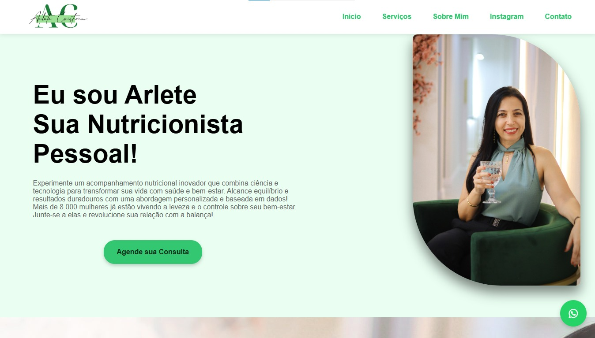

# Landing Page para Nutricionista

Este repositório contém o código-fonte de uma landing page desenvolvida para uma nutricionista. O objetivo do projeto é apresentar os serviços oferecidos, depoimentos de clientes e fornecer uma interface moderna, funcional e totalmente responsiva.

## 🌟 Funcionalidades

- **Design Responsivo**: Totalmente adaptável a dispositivos móveis, tablets e desktops.
- **Seção de Feedback de Clientes**: Carrossel interativo com depoimentos reais para aumentar a credibilidade.
- **Animações Sofisticadas**: Efeitos visuais modernos para aprimorar a experiência do usuário.
- **Fundo Temático Animado**: Fundo exclusivo com tons de verde e elementos relacionados à nutrição, simbolizando saúde e equilíbrio.
- **Formulário de Contato Integrado**: Facilita a comunicação direta com a nutricionista.

## 🛠️ Tecnologias Utilizadas

- **HTML5**: Estrutura semântica e acessível.
- **CSS3**: Estilos modernos e design responsivo.
- **JavaScript**: Funcionalidades dinâmicas e interativas.
- **Font Awesome**: Ícones profissionais para redes sociais e outros elementos.
- **Google Fonts**: Tipografia sofisticada e personalizada.

## 🎨 Estrutura do Projeto

- **Home**: Apresentação da nutricionista e destaques dos serviços.
- **Sobre Mim**: Informações profissionais e qualificações detalhadas.
- **Serviços**: Descrição completa dos serviços oferecidos.
- **Feedback**: Depoimentos exibidos em um carrossel dinâmico.
- **Contato**: Formulário para facilitar o contato com integração por e-mail.

## 📸 Demonstração



## 🚀 Como Executar o Projeto

1. Clone o repositório:
   ```bash
   git clone https://github.com/Maurocesar12/landing-page-nutricionista.git
   ```
2. Acesse o diretório do projeto:
   ```bash
   cd landing-page-nutricionista
   ```
3. Abra o arquivo `index.html` em seu navegador preferido para visualizar a página.

## 📂 Estrutura de Arquivos

```
├── index.html
├── css
│   ├── style.css
│   └── animations.css
├── js
│   ├── main.js
│   └── carrossel.js
├── images
│   ├── background.png
│   ├── cliente1.jpg
│   └── cliente2.jpg
└── README.md
```

## 🌱 Inspirações e Estilo

O design foi inspirado em elementos naturais e minimalistas, com uma paleta de cores predominantemente verde, que simboliza saúde, bem-estar e harmonia. As animações foram criadas para proporcionar uma experiência visual fluida e envolvente.

## 📞 Contato

Caso tenha dúvidas, sugestões ou precise de mais informações, entre em contato:
- **Email**: Mauroguima080@hotmail.com
- **Portfólio**: [Meu Portfólio](https://maurocesar12.github.io/PortfolioPessoal/)
- **LinkedIn**: [Perfil Likedin](https://www.linkedin.com/in/mauro-c%C3%A9sar-guimaraes-santos-junior-b9638b203/)

---
**Desenvolvido por Mauro César Guimarães**
